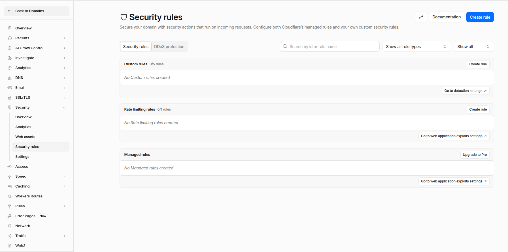

# Cloudflare Security Rules

Cloudflare's Web Application Firewall (WAF) helps protect your website from malicious traffic, brute-force attacks, bots, and other security threats. This guide explains how to create common security rules for WordPress websites.

## Prerequisites

Before creating any rules:

1. Log in to your [Cloudflare](https://www.cloudflare.com/) Dashboard.
2. Select your website.
3. Navigate to **Security > WAF/Security Rules**.
4. Click **Create Rule**.



---

## Create a Rate Limiting Rule

Rate Limiting helps protect your website from brute-force attacks and excessive requests.

### Step 1: Navigate to Rate Limiting Rules

1. Open your Cloudflare Dashboard.
2. Select your domain.
3. Go to **Security > WAF/Security Rules**.
4. Click **Create Rule**.
5. Click **Rate limiting rules**.


### Step 2: Configure the Rule

Enter the following details:

**Rule Name**

```text
Protect wp-login
````

**Field**

```text
URI Path
```

**Operator**

```text
equals
```

**Value**

```text
/wp-login.php
```

### Step 3: Configure Rate Limit Settings

Configure the following settings:

| Setting  | Value             |
| -------- | ----------------- |
| Requests | 10                |
| Period   | 1 minute          |
| Action   | Managed Challenge |
| Duration | 10 minutes        |

### Step 4: Deploy the Rule

1. Review the configuration.
2. Click **Deploy**.
3. Verify the rule appears in the Rate Limiting Rules list.

---

## Block XML-RPC Requests

The XML-RPC endpoint is frequently targeted by attackers for brute-force and DDoS attacks. If your website does not require XML-RPC functionality, blocking it is recommended.

### Step 1: Create a Custom Rule

1. Open **Security > WAF/Security Rules**.
2. Click **Create Rule**.
3. Click **Custom Rules**.

### Step 2: Configure the Rule

**Rule Name**

```text
Block XML-RPC
```

### Step 3: Add Expression

Select:

| Field    | Operator | Value       |
| -------- | -------- | ----------- |
| URI Path | equals   | /xmlrpc.php |

Or use the expression editor:

```text
(http.request.uri.path eq "/xmlrpc.php")
```

### Step 4: Select Action

Choose:

```text
Block
```

### Step 5: Deploy the Rule

1. Click **Deploy**.
2. Test access to:

```text
https://yourdomain.com/xmlrpc.php
```

The request should be blocked by Cloudflare.

---

## Protect the WordPress Login Page (wp-login.php)

The WordPress login page is a common target for brute-force login attempts.

### Step 1: Create a Custom Rule

1. Navigate to **Security > WAF/Security Rules**.
2. Click **Create Rule**.
3. Click **Custom Rules**.

### Step 2: Configure the Rule

**Rule Name**

```text
Protect WordPress Login
```

### Step 3: Add Expression

Select:

| Field    | Operator | Value         |
| -------- | -------- | ------------- |
| URI Path | equals   | /wp-login.php |

Or use the expression editor:

```text
(http.request.uri.path eq "/wp-login.php")
```

### Step 4: Select Action

Recommended:

```text
Managed Challenge
```

Alternative:

```text
Block
```

### Step 5: Deploy the Rule

1. Click **Deploy**.
2. Open your WordPress login page.
3. Verify Cloudflare challenges suspicious visitors before granting access.

---

## Best Practices

* Use **Managed Challenge** instead of **Block** whenever possible.
* Monitor Cloudflare Security Events after deploying new rules.
* Test each rule before applying it to production environments.
* Review security logs regularly for false positives.
* Combine WAF rules with Rate Limiting for stronger protection.

## Troubleshooting

### Legitimate Users Are Being Blocked

1. Open **Security > Events**.
2. Locate blocked requests.
3. Review the triggering rule.
4. Modify the rule or add an exception if necessary.

### Login Page Is Inaccessible

1. Verify the rule expression.
2. Check the rule action.
3. Temporarily disable the rule for testing.
4. Confirm there are no conflicting Cloudflare rules.

```
```
