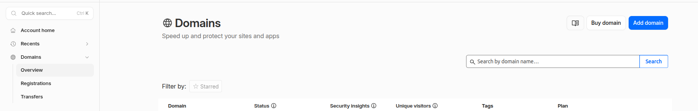

# Move Your DNS to Cloudflare

Migrating your DNS management to Cloudflare provides enhanced performance, security, and reliability. This guide walks you through the process of transferring your DNS records to Cloudflare and updating your domain's nameservers.

## Prerequisites

Before starting the migration, ensure that you have:

* Access to your domain registrar account.
* An active [Cloudflare account](https://www.cloudflare.com/).
* A complete list of your existing DNS records.
* Administrative access to your current DNS provider.


## Migrating DNS to Cloudflare
### Step 1: Add Your Domain to Cloudflare

1. Log in to your Cloudflare dashboard.
2. Click on **Domain > Add domain**.

    

3. Select  **Connect a Domain**.
4. Enter your domain name and click **Continue**.
5. Select the desired Cloudflare plan.
6. Click **Continue**.

### Step 2: Review Imported DNS Records

Cloudflare will automatically scan and import your existing DNS records.

1. Review all imported records carefully.
2. Verify that the following records are present:

   * A Records
   * AAAA Records
   * CNAME Records
   * MX Records
   * TXT Records
   * SPF, DKIM, and DMARC records
3. Add any missing records manually.

> **Important:** Ensure all email-related DNS records are correctly configured to avoid email delivery issues.

### Step 3: Update Nameservers

After confirming your DNS records:

1. Cloudflare will provide two nameservers.
2. Log in to your domain registrar.
3. Locate the nameserver settings.
4. Replace the existing nameservers with the Cloudflare nameservers.
5. Save the changes.

Example:

```text
Current Nameservers:
ns1.oldprovider.com
ns2.oldprovider.com

Cloudflare Nameservers:
jane.ns.cloudflare.com
john.ns.cloudflare.com
```

### Step 4: Wait for DNS Propagation

Nameserver changes may take up to 24–48 hours to fully propagate worldwide.

You can monitor propagation using:

```bash
dig NS example.com
```

or

```bash
nslookup -type=NS example.com
```

Verify that the results return the Cloudflare nameservers assigned to your domain.

### Step 5: Confirm Domain Activation

Return to the Cloudflare dashboard and verify that your domain status changes to:

```text
Active
```

Once active, Cloudflare begins serving DNS and applying configured security and performance features.

## Troubleshooting

### Website Not Loading

* Verify A and CNAME records.
* Confirm nameservers have propagated.
* Check SSL/TLS settings in Cloudflare.

### Email Not Working

* Verify MX records.
* Confirm SPF, DKIM, and DMARC records.
* Ensure mail-related records are set to **DNS Only**.

### Incorrect DNS Resolution

Use:

```bash
dig example.com
```

to validate DNS responses and compare them with your intended configuration.

## Rollback Procedure

If you encounter critical issues:

1. Log in to your domain registrar.
2. Restore the previous nameservers.
3. Wait for DNS propagation to complete.

This will return DNS management to the previous provider.

