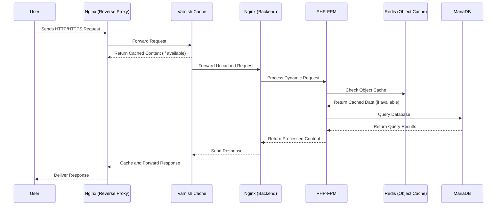

# Architecture 

WPOven is a fully managed WordPress hosting platform designed to provide high performance, security, and ease of use. 
Below is an overview of the architecture that powers WPOven.

## Overview

WPOven's architecture is optimized for speed, scalability, and reliability. It uses a multi-layered approach that combines powerful caching mechanisms, advanced server configurations, and a user-friendly management interface.

### Key Components

#### 1. **Server Stack**
WPOven employs a robust server stack tailored for WordPress performance:
- **Nginx**: Acts as a reverse proxy for handling incoming traffic efficiently.
- **Varnish Cache**: Serves as a caching layer between Nginx and the backend, drastically improving page load times.
- **PHP-FPM**: Processes dynamic PHP requests using the latest PHP versions optimized for WordPress.
- **MariaDB**: A high-performance database server for managing WordPress data.

#### 2. **Caching Layers**
WPOven utilizes multiple caching techniques to ensure lightning-fast performance:
- **Full Page Caching**: Managed by Varnish for serving cached pages instantly.
- **Object Caching**: Redis is used to cache database queries, reducing load times for dynamic content.
- **Browser Caching**: Configured via Nginx to store static assets locally on the user's browser.

#### 3. **Security Features**
Security is a cornerstone of WPOven's architecture:
- **Web Application Firewall (WAF)**: Protects against malicious attacks like SQL injection and XSS.
- **Malware Scanning**: Automated daily scans to detect and remove malware.
- **SSL/TLS Encryption**: Ensures all sites are served over HTTPS by default.
- **Automatic Backups**: Scheduled backups with the ability to restore in one click.

#### 4. **High Availability**
WPOven's infrastructure is designed for high availability and minimal downtime:
- **Cloud-based Infrastructure**: Leverages data centers from top providers like Akami , AWS and DigitalOcean.
- **Auto-healing Servers**: Automatically detects and resolves common server issues without user intervention.
- **Load Balancing ( Select Plans )**: Distributes traffic across multiple servers to ensure stability during high traffic periods.

#### 5. **Developer-Friendly Features**
WPOven provides tools and features tailored for developers:
- **Staging Environments**: Easily create and test changes before deploying to production.
- **SSH Access**: Direct access to the server for advanced customizations and running WP CLI commands.
- **Git Integration**: Seamless deployment of code from repositories.

#### 6. **Management Dashboard**
The WPOven dashboard is the central hub for managing all aspects of your hosting:
- **Server Management**: - Add, delete, or manage servers on which you may host your sites.
- **Site Management**: Add, delete, or clone WordPress sites effortlessly.
- **Performance Monitoring**: Real-time metrics for server performance and resource usage.
- **One-click Tools**: Manage caching, enable HTTPS, or use built in file manager with a single click.

## Request Flow Diagram

## Conclusion

WPOven's architecture is built to deliver unmatched performance, security, and scalability for WordPress users. Whether you're a developer, agency, or business owner, WPOven provides the tools and infrastructure to ensure your sites run smoothly and securely.    