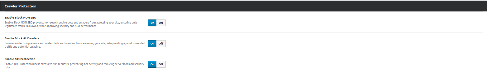

**Contributors:** [WPOven](https://www.wpoven.com/)  
**Requires at least:** 6.6.2  
**Tested up to:** 6.6.2  
**Stable tag:** 1.0.0  
**License:** GPLv2 or later  
**License URI:** [http://www.gnu.org/licenses/gpl-2.0.html](http://www.gnu.org/licenses/gpl-2.0.html)

## Introduction

WPOven CloudShield is a robust security plugin designed to safeguard your WordPress website using Cloudflare's powerful capabilities. This plugin provides comprehensive protection against various threats, ensuring the safety and performance of your site.

## Prerequisites

This plugin needs to create a dummy custom rule. This step will generate the unique ID required for http_request_firewall_custom.
This ID is essential for creating and managing your actual custom rules, after creation delete the dummy rule to avoid clutter in your WAF dashboard.

### Create a Dummy Custom Rule in Cloudflare

Follow the steps below to create a custom rule for your domain in Cloudflare:

- Log in to your Cloudflare account.
- Select your **domain** from the dashboard.
- Click on **Security** in the left-hand menu.
- Inside the **Security** section, click on **WAF** (Web Application Firewall).
- On the WAF security dashboard, click on Custom Rules.
- Click on the **Create Rule** button to start creating your custom rule.
- Provide a descriptive name for your rule in the Rule Name field.
- Define the rule conditions:
  - **Field**: Select `URI`, `URI Full`, or another appropriate field.
  - **Operator**: Choose `wildcard`, `equals`, or another operator.
  - **Value**: Enter the specific value, such as `/example.php`.
- Take action when the rule matches:
  - **Choose Action**: Select from the following:
    `Managed Challenge`,
    `JS Challenge`,
    `Interactive Challenge`,
    `Block`,
    `Skip`
- Click **Deploy** to activate your custom rule.
- To delete the custom rules, click on the three dots on the right side of the dashboard, and then click the Delete button.

 **Message**: Ensure the dummy custom rule is deleted after deploy to maintain a clean and organized rules list.

### Create Cloudflare API Token

Follow these simple steps to create and use a secure API Token instead of the Global API Key:

- In Cloudflare account dashboard navigate to **My Profile**.
- Under the API Tokens section, click **Create Token**.
- Click on **Get Started** at Create Custom Token and set the following permissions:
  - **Token Name**: As per your need.
- **Permissions**: Select Zone and set the following:
  - **Zone WAF**: `Edit`, `Read`
  - **Zone**: `Read`
- **Zone Resources**: Select zones to include. Ensure the token applies to the specific zone you wish to manage.
- **Client IP Address Filtering**: Not required.
- Set the **TTL (Time to Live)** for the token: **Not required**
  - **Start Date**: Like today.
  - **End Date**: As long as you need.
  - **Note**: If the token expires, your plugin will be unable to create, update, or delete Cloudflare WAF rules.
- Click on **Countinue to summary** & then Click **Create Token** and copy the generated token.
- Enter the API Token and your email address into the form below and click **Save Changes**.
- Select the **domain** for which you want to enable the WAF settings and click **Save Changes**.

 **Note**: Using an API Token is more secure and recommended over the Global API Key as it provides fine-grained permissions and an expiration period.
## Installation

### Download the Plugin

- To get the latest version of WPOven Cloudshield :
  - Download directly from the GitHub repository: [Download](https://github.com/baseapp/wpoven_cloudshield/releases).

### Install the Plugin

- Log in to your WordPress admin dashboard.
- Go to Plugins **Plugins > Add New**.
- Click **Upload Plugin** button.
- Select the downloaded ZIP file and click **Install Now**.

### Activate the Plugin

- Once installed, click **Activate Plugin** to start using it.

## Configure Cloudshield Settings

Once activated, go to **WPOven > Cloudshield** in the WordPress admin menu.

- **Enable Logs**

  - **Description:** Allows logging of events and actions.

- **Logs Retention**

  - **Description:** Defines how long logs will be retained.
  - **Options:**
    - 1 day only
    - 7 days (default)
    - Unlimited

- **Authentication Mode**

  - **Description:** Determines the authentication method used to connect to Cloudflare.
  - **Options:**
    - API Token
    - API Key

- **Cloudflare e-mail**

  - **Description:** The email address associated with the Cloudflare account.
  - **Required:** Yes

- **Cloudflare API Token**

  - **Description:** API token required to authenticate and connect with Cloudflare.
  - **Required:** Yes

- **Save Changes Button**
  - **Description:** Saves all modified settings.
  - **Action:** Commits the changes to the system.

## Cloudshield Controller

## WAF Settings

- ### Login Protection Settings

  

  The **Login Protection** section enhances security by preventing unauthorized access, brute force attacks, and restricting login access based on country.

  - **Enable Cloudflare Captcha**

    - **Description:** Enables Cloudflare Captcha to protect your website from bots and ensure only legitimate traffic can access it.
    - **Benefit:** Reduces automated login attempts and enhances security.

  - **Block Cloudflare XMLRPC**

    - **Description:** Blocks Cloudflare XMLRPC to prevent unauthorized access and enhance website security against brute force attacks.
    - **Benefit:** Protects against exploits that target XMLRPC.

  - **Block Wrong Login**

    - **Description:** Blocks wrong login attempts after multiple failed tries to enhance security and prevent brute force attacks.
    - **Benefit:** Reduces brute force login attempts by locking accounts temporarily.

  - **Request Rate**

    - **Description:** Defines the maximum number of incorrect login attempts allowed before blocking further attempts.
    - **Functionality:** Cloudflare controls request rates to prevent multiple login failures within a specified time frame.
    - **Example Value:** `5` (User can adjust this value using a slider or input field.)

  - **Enable Country Block**

    - **Description:** Restricts login access, allowing only specified countries.
    - **Benefit:** Enhances security by preventing login attempts from unauthorized locations.

  - **Allow Country**
    - **Description:** Allows login access only from selected countries.
    - **Functionality:** The user can choose specific countries from a dropdown list, and login attempts from other locations will be blocked.

- ### DDoS Protection Settings

  

  The **DDoS Protection** section provides security settings to prevent denial-of-service attacks and unauthorized access by bots or malicious users.

  - **Enable Request Rate**

    - **Description:** Enables request rate limiting to block IPs that exceed a specified number of requests within a given time period.
    - **Benefit:** Prevents bot abuse, DDoS attacks, and excessive server requests.

  - **Request Rate**

    - **Description:** Defines the maximum number of requests allowed per time period.
    - **Functionality:** Rate limiting rules (e.g., Cloudflare) control request rates to prevent abuse, DDoS attacks, and server overload.
    - **Example Value:** `10` (User can adjust this value using a slider or input field.)

  - **Enable IP Block**

    - **Description:** Restricts access from specific IP addresses.
    - **Benefit:** Enhances site security and control by preventing unwanted traffic.

  - **Block IP**

    - **Description:** Allows users to manually enter and block specific IP addresses.
    - **Functionality:** If an IP is selected, the system will prevent requests from that IP, improving security.
 

- ### Crawler Protection Settings

  

  The **Crawler Protection** section provides security settings to prevent unwanted bot activity and optimize website performance.

  - **Enable Block NON SEO**

    - **Description:** Blocks non-search engine bots and scrapers from accessing your site.
    - **Benefit:** Ensures only legitimate traffic is allowed while improving security and SEO performance.

  - **Enable Block AI Crawlers**

    - **Description:** Prevents automated bots and crawlers from accessing your site.
    - **Benefit:** Safeguards against unwanted traffic and potential scraping.

  - **Enable 404 Protection**

    - **Description:** Blocks excessive 404 requests.
    - **Benefit:** Prevents bot activity, reduces server load, and enhances security.

## Features

- **Cloudflare-Integrated Login Captcha:**
  Adds an intelligent login CAPTCHA to secure your admin login page and prevent unauthorized access attempts.

- **IP Blocking:**
  Blocks IP addresses based on specific conditions, including: 
   -  Multiple failed login attempts. 
   -  Custom-defined IP blocks. 
   -  Excessive request rates.

- **Country Blocking:**
  Restrict access to your site from specific countries, giving you full control over regional access.

- **XMLRPC Blocking:**
  Disables XMLRPC endpoints to prevent exploitation and brute-force attacks targeting this protocol.

- **Crawler Management:**
  Blocks unwanted crawlers, such as non-SEO crawlers and AI bots, to ensure only legitimate traffic reaches your website.

- **404 Protection:**
  Provides additional safeguards against 404 client errors, such as bad requests, to enhance server performance and resilience.

## Frequently Asked Questions

- #### What does WPOven CloudShield do?
  WPOven CloudShield secures your WordPress site by integrating Cloudflare features like login CAPTCHA, IP blocking, country restrictions, bot management, and XMLRPC protection.
- #### How does the plugin block unwanted crawlers?
  The plugin identifies and blocks non-SEO and AI crawlers, ensuring only legitimate traffic interacts with your site, reducing server load and enhancing performance.
- #### Can I block specific countries from accessing my website?
  Yes, WPOven CloudShield allows you to restrict access from specific countries through its country-blocking feature.
- #### Does the plugin protect against brute-force login attacks?
  Absolutely. The plugin uses Cloudflare's CAPTCHA and IP blocking to prevent brute-force attacks and unauthorized access attempts effectively.
- #### How is IP blocking managed?
  IPs can be blocked based on failed login attempts, custom rules, high request rates, or other suspicious activity patterns.
- #### Does WPOven CloudShield work with all WordPress setups?
  Yes, the plugin is compatible with most WordPress setups and works seamlessly with Cloudflare to enhance your site's security.

## Changelog

- **1.0.0** ( **_Dec 11, 2024_** )

  - Initial release with Added Cloudflare integration with CAPTCHA, IP blocking, country restrictions, XMLRPC protection, crawler management,
    404 protection, and a user-friendly security settings interface.

## Upgrade Notice

- Regularly update the plugin to ensure compatibility with future WordPress versions.
