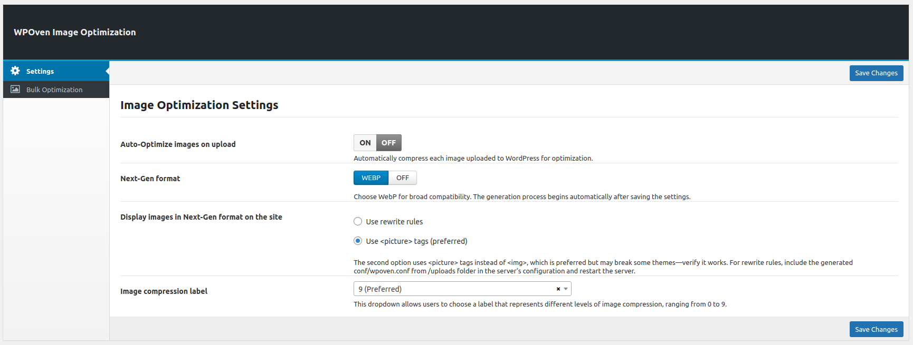
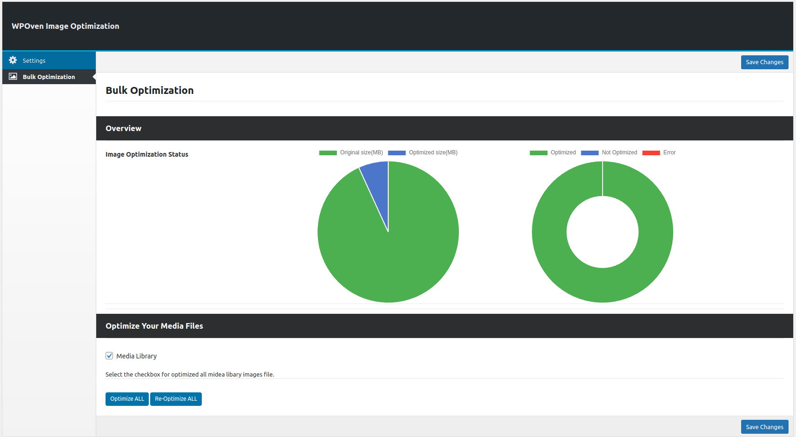

**Contributors:** [WPOven](https://www.wpoven.com/)  
**Requires at least:** 6.6.2  
**Tested up to:** 6.6.2  
**Stable tag:** 1.0.0  
**License:** GPLv2 or later  
**License URI:** [http://www.gnu.org/licenses/gpl-2.0.html](http://www.gnu.org/licenses/gpl-2.0.html)

## Introduction

WPOven Image Optimization is a WordPress plugin designed to enhance website performance by converting images to the WebP format. This helps in reducing file sizes and improving page load speeds, which boosts SEO and user experience.

The plugin offers automatic optimization on image upload, bulk optimization for existing media, and various compression levels to balance quality and file size. It also supports multiple methods for serving WebP images, including rewrite rules and the `<picture>` tag approach for maximum compatibility.

With its easy-to-use interface and powerful optimization features, WPOven Image Optimization ensures your website stays fast and efficient.

## Installation

### Download the Plugin

- To get the latest version of WPOven Image Optimization :
  - Download directly from the GitHub repository: [Download](https://github.com/baseapp/wpoven_imageoptim/releases).

### Install the Plugin

- Log in to your WordPress admin dashboard.
- Go to Plugins **Plugins > Add New**.
- Click **Upload Plugin** button.
- Select the downloaded ZIP file and click **Install Now**.

### Activate the Plugin

- Once installed, click **Activate Plugin** to start using it.

### Configure Plugin Settings

Once activated, go to **WPOven > Image Optimization** in the WordPress admin menu.

#### Configuration Fields :

- #### Auto-Optimize images on upload
    -  **Toggle: ON/OFF**
        - When enabled, every uploaded image is automatically optimized.

- #### Next-Gen format
    - **Options:**
        - `WEBP`: Generates WebP versions of images.
        - `OFF`: Disables WebP generation.

- #### Display images in Next-Gen format on the site
    - **Options:**
        - **Use rewrite rules**
            - Uses server-side rules to serve WebP images.
            - Requires adding `conf/wpoven.conf` to the server and restarting it.
        - **Use `<picture>` tags ( ***Preferred*** )**
            - Uses `<picture>` tags instead of ``, ensuring better compatibility.
  
- #### Image compression label
    - **Dropdown (0-9)**
        - `0` = No compression (higher quality).
        - `9` = Maximum compression (smaller size, lower quality).

- #### Save Changes
    - **Button** to save all the selected options.

### Bulk Optimization

- ### Overview
    - #### Image Optimization Status
        Displays two pie charts:
        - **First Chart:** Original vs. Optimized Size
            - 🟢 Original size (MB)
            - 🔵 Optimized size (MB)
  
        - **Second Chart:** Optimization Status
            - 🟢 Optimized
            - 🔵 Not Optimized
            - 🔴 Error

- ### Optimize Your Media Files
    - **Media Library Checkbox**
        - Select to optimize all media library image files.

    - **Buttons**
        - 🟦 **Optimize ALL** → Optimizes unoptimized images.
        - 🟦 **Re-Optimize ALL** → Re-optimizes all images.

- ### Save Changes
    - **Button** to save selected settings.

## Features

- **Automatic Image Optimization on Upload**  
    Every image uploaded to the **WordPress Media Library** is automatically optimized.  
    Supports conversion to **WebP format** for better performance.  
    Ensures images are optimized without manual intervention.  

- **Bulk Image Optimization**
    Optimize all existing images in your **media library** with one click.  
    Provides an **overview dashboard** to track optimization progress.  
    **Buttons for "Optimize ALL" and "Re-Optimize ALL"** to control bulk processing.  

- **Next-Gen Image Format Support**  
    Converts images to **WebP** for **faster load times** and **better SEO**.  
    Offers **two methods** to serve WebP images:  
    - **Rewrite Rules**: Uses server-side rules for automatic WebP delivery.  
    - **Picture Tags (Preferred)**: Ensures compatibility by replacing `` with `<picture>`.  

- **Optimization Statistics & Reports** 
    **Visual pie charts** displaying:  
    - **Original vs. Optimized Image Sizes** (MB saved).  
    - **Optimization Status** (Optimized, Not Optimized, Errors).  

## Frequently Asked Questions

- #### What Is WPOven Image Optimization?

    WPOven Image Optimization converts images to WebP, reducing file sizes for faster loading, improved performance, and enhanced user experience with bulk and auto optimizations features.

- #### Will this plugin affect image quality?

    No, the plugin optimizes images to reduce file size while maintaining visual quality. You can also adjust optimization settings for a balance between quality and file size.

- #### Does this plugin support other formats besides WebP?

    Currently, the plugin focuses on WebP optimization, but future updates may include support for formats like AVIF.

- #### Is WebP supported on all browsers?

    Most modern browsers support WebP. If a visitor’s browser doesn’t support WebP, the plugin serves the original format instead.

- #### Do I need to manually convert each image?

    No, the plugin automatically optimizes new uploads. For existing images, you can use the bulk optimization feature to convert them all at once.

- #### Will optimizing images improve my SEO ranking?

    Yes, Google favors faster-loading pages. By reducing image load times, your SEO ranking can improve due to better page performance and user experience.

## Changelog

- **1.0.0** ( ***Nov 13, 2024*** )

    - Initial release with optimized image delivery in modern WebP format to improve load times and enhance SEO performance.

    - Built-in support for converting images automatically to WebP on adding/upload images, ensuring compatibility with all major browsers.

## Upgrade Notice

- Regularly update the plugin to ensure compatibility with future WordPress versions.
