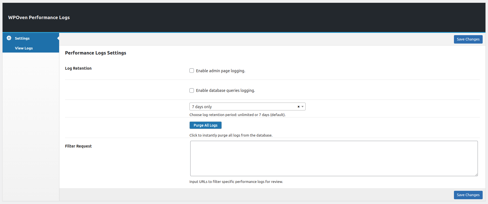

**Contributors:** [WPOven](https://www.wpoven.com/)  
**Requires at least:** 6.6.2  
**Tested up to:** 6.6.2  
**Stable tag:** 1.0.0  
**License:** GPLv2 or later  
**License URI:** [http://www.gnu.org/licenses/gpl-2.0.html](http://www.gnu.org/licenses/gpl-2.0.html)

## Introduction

WPOven Performance Logs is a powerful WordPress plugin designed to track and analyze website performance metrics. It provides detailed insights into PHP execution time, database query execution, CPU load, IP tracking, and memory usage. This plugin is ideal for developers, site owners, and agencies who want to monitor and optimize their website’s performance efficiently.

With features like admin page logging, database query logging, log retention settings, and URL filtering, WPOven Performance Logs helps users identify performance bottlenecks and improve website speed and stability. The plugin is free to use and ensures seamless integration with WordPress.

## Installation

### Download the Plugin

- To get the latest version of WPOven Performance Logs :
  - Download letest from the GitHub repository: [Download](https://github.com/baseapp/wpoven_perflogs/releases).

### Install the Plugin

- Log in to your WordPress admin dashboard.
- Go to Plugins **Plugins > Add New**.
- Click **Upload Plugin** button.
- Select the downloaded ZIP file and click **Install Now**.

### Activate the Plugin

- Once installed, click **Activate Plugin** to start using it.

## Configure Performance Logs Settings

Once activated, go to **WPOven > Performance Logs** in the WordPress admin menu.

#### Configuration Fields 
<!-- 
- #### Log Retention 
    - **Enable admin page logging**  
      - Toggle this option to log all admin page activities.
  
    - **Enable database queries logging**  
      - Toggle this option to log all database queries.

    - **Log Retention Period**
      - Choose how long logs should be stored :
        - **Unlimited**: Logs are never deleted.
        - **7 days only (Default)**: Logs older than 7 days are automatically removed.

    - **Purge All Logs Button**  
      - Clicking this button deletes all stored logs immediately.

- #### Filter URLs
 
    - Enter specific URLs to filter logs and review performance-related data. -->

### Log Retention

| Field                              | Description                                              |
|--------------------------------------|----------------------------------------------------------|
| **Enable admin page logging**        | Toggle this option to log all admin page activities.     |
| **Enable database queries logging**  | Toggle this option to log all database queries.          |
| **Log Retention Period**             | Choose how long logs should be stored:   **Unlimited**: Logs are never deleted.  **7 days only (Default)**: Logs older than 7 days are automatically removed.                                                                        |
| **Purge All Logs Button**            | Clicking this button deletes all stored logs immediately.|

### Filter Request

| Field   | Description |
|---------------|-----------------|
| **Filter Request** | Enter specific URLs to filter logs and review performance-related data. |

## Features

- **Performance Monitoring & Logging:**

  Tracks key metrics: PHP execution time, database query execution time, number of queries, CPU load, IP tracking, and memory usage.

- **Admin Page Activity Logging**

  Logs admin page activities to track backend performance.

- **Database Query Logging**

  Captures and logs all database queries for performance insights.

- **Log Retention Management**

  Set retention periods:
    - **Unlimited:** Logs never deleted.
    - **7 Days (Default):** Older logs are automatically removed.

- **Log Purging**

  One-click **Purge All Logs** button for instant cleanup.

- **URL Filtering for Logs**

  Filter logs based on specific URLs for detailed analysis.

## Frequently Asked Questions

- #### What is WPOven Performance Logs?

    WPOven Performance Logs plugin, designed to help you monitor critical performance metrics. Effortlessly log PHP execution time, database query execution time, total    number of queries executed, CPU load time, IP address tracking, and peak memory usage to monitor your website's performance.

- #### Is the 'WPOven Performance Logs' plugin free?

    Yes, completely free with no hidden charges.

- #### Who should use this plugin?

    Perfect for developers, site owners, and agencies who need deep insights into WordPress performance,server resources, and optimization opportunities.

- #### Can I delete log entries?

    Yes, you can delete all Performance logs.

## Changelog

- **1.0.0** ( ***Dec 11, 2024*** )

    - Initial release with added performance monitoring for PHP execution time, database queries, CPU load, IP tracking, and peak memory usage in the WPOven Performance Logs plugin.

## Upgrade Notice

- Regularly update the plugin to ensure compatibility with future WordPress versions.
