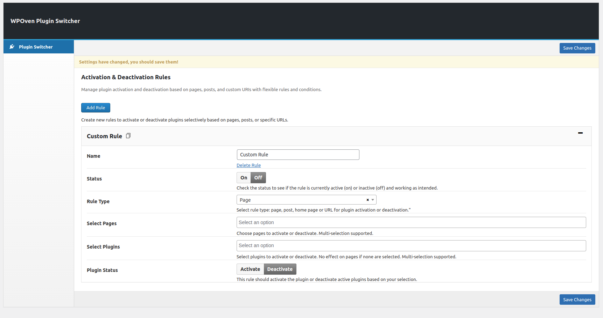

# WPOven Plugin Switcher

**Contributors:** [WPOven](https://www.wpoven.com/)  
**Requires at least:** 6.6.2  
**Tested up to:** 6.6.2  
**Stable tag:** 1.0.0  
**License:** GPLv2 or later  
**License URI:** [http://www.gnu.org/licenses/gpl-2.0.html](http://www.gnu.org/licenses/gpl-2.0.html)

## Introduction

WPOven Plugin Switcher is a powerful WordPress plugin management tool that allows users to activate or deactivate plugins on specific pages, posts, or custom URLs. 
It helps optimize site performance by enabling granular control over plugin usage without affecting the entire website. With an intuitive interface, customizable rules, and seamless WordPress integration, it streamlines plugin management for a more efficient and tailored website experience.

## Installation

### Download the Plugin

- To get the latest version of WPOven Plugin Switcher :
  - Download directly from the GitHub repository: [Download](https://github.com/baseapp/wpoven_pluginswitcher/releases).

### Install the Plugin

- Log in to your WordPress admin dashboard.
- Go to Plugins **Plugins > Add New**.
- Click **Upload Plugin** button.
- Select the downloaded ZIP file and click **Install Now**.

### Activate the Plugin

- Once installed, click **Activate Plugin** to start using it.

## Configure Plugin Settings

Once activated, go to **WPOven > Plugin Switcher** in the WordPress admin menu.

#### Configuration Fields :
<!-- 
- **Add Rule Button:**  
  Allows users to create a new rule for plugin activation or deactivation.

- **Custom Rule (Title Box):**  
  This is the name of the rule. It can be customized for better identification.

- **Name:**  
  A text field where users can specify the name of the custom rule.

- **Delete Rule:**  
  Clicking this will remove the current rule.

- **Status (On/Off Toggle):**  
  Indicates whether the rule is active (**On**) or inactive (**Off**).

- **Rule Type (Dropdown Selection):**  
  Defines the type of rule:

  - **Page:** Targets specific pages.
  - **Post:** Targets specific posts.
  - **Home Page:** Targets the homepage.
  - **URL:** Targets a custom URL.

- **Select Pages (Dropdown Selection):**  
  Lets users choose the pages where the rule will be applied (multi-selection supported).

- **Select Plugins (Dropdown Selection):**  
  Allows users to select which plugins to activate or deactivate. If no plugins are selected, the rule will have no effect.

- **Plugin Status (Activation & Deactivation Buttons):**

  - **Activate:** The selected plugins will be enabled for the chosen pages/posts.
  - **Deactivate:** The selected plugins will be disabled for the chosen pages/posts. -->

| **Field**                         | **Description** |
|--------------------------------------|---------------------------------------------------------------------------------------------------------------------------------|
| **Add Rule Button**                  | Allows users to create a new rule for plugin activation or deactivation.                                                      |
| **Custom Rule (Title Box)**          | This is the name of the rule. It can be customized for better identification.                                                 |
| **Name**                             | A text field where users can specify the name of the custom rule.                                                             |
| **Delete Rule**                      | Clicking this will remove the current rule.                                                                                   |
| **Status (On/Off Toggle)**           | Indicates whether the rule is active (**On**) or inactive (**Off**).                                                          |
| **Rule Type (Dropdown Selection)**   | Defines the type of rule:**Page** - Targets specific pages.**Post** - Targets specific posts.**Home Page** - Targets the homepage.**URL** - Targets a custom URL. |
| **Select Pages (Dropdown Selection)** | Lets users choose the pages where the rule will be applied (multi-selection supported).                                       |
| **Select Plugins (Dropdown Selection)** | Allows users to select which plugins to activate or deactivate. If no plugins are selected, the rule will have no effect.  |
| **Plugin Status (Activation & Deactivation Buttons)** | **Activate** - The selected plugins will be enabled for the chosen pages/posts.**Deactivate** - The selected plugins will be disabled for the chosen pages/posts. |

## Usage

- To activate or deactivate plugins on specific pages or posts, follow the instructions in the plugin settings.

## Regular Updates

- Keep the plugin updated for the latest features and security improvements. You can update the plugin through the **Plugins** section in your WordPress admin dashboard.

## Features

- **Easy Plugin Management**  

  Effortlessly activate or deactivate plugins on specific pages, posts, or custom URLs.

- **Customizable Rules**  

  Create custom rules for plugin activation based on page/post types or specific URLs.

- **Multi-Page/Multiple Plugin Support**  

  Activate or deactivate plugins on multiple pages or posts at once for time-saving flexibility.

- **Homepage Plugin Control**  

  Manage plugin activation for your homepage separately for optimized performance.

- **Granular Control over Plugin Activation**  

  Activate or deactivate specific plugins for individual pages, posts, or a custom URL, without affecting the entire site.

- **On/Off Toggle for Rules**  

  Easily toggle plugin rules on or off for simple management.

- **Rule Type Dropdown**  

  Choose whether the rule applies to a page, post, homepage, or custom URL.

- **User-Friendly Interface**  

  An intuitive dashboard to manage plugin settings with clear options for rule creation, plugin selection, and status control.

- **Seamless Integration with WordPress**  

  Simple installation, activation, and configuration process, with no coding required.

- **Optimized Site Performance**  

  Disable unnecessary plugins for specific pages or posts, reducing resource consumption and speeding up site loading times.

## Frequently Asked Questions

-  #### What Is WPOven Plugin Switcher?

    WPOven Plugin Switcher is a WordPress plugin management tool that enables website owners to choose which plugins to activate or deactivate on specific pages or posts.

-  #### How do I activate & deactivate a WordPress plugin on a specific page or post?

    To activate & deactivate a WordPress plugin on a specific page or post, you can use WPOven Plugin Switcher. This plugin allows you to activate & deactivate any plugin,
    including WordPress core plugins, on a specific page or post or using a custom URL.

-  #### Can I activate & deactivate plugins for multiple pages or posts at once?

    Yes, you can select multiple pages or posts to activate & deactivate a plugin.

-  #### Can WPOven Plugin Switcher activate & deactivate multiple plugins at once?

    Yes, WPOven Plugin Switcher allows you to activate & deactivate multiple plugins simultaneously, saving you time and effort.

-  #### How can I disable WordPress plugins by custom URL?

    You can activate & deactivate a plugin via a custom URL. For example, consider that you are using the WooCommerce Plugin.
    You likely don't need to load the WooCommerce CSS/JS files on contact pages. To do this:

    1.  Enable status -> On
    2.  Rule Type -> URL or Page or Post
    3.  Select Plugins -> WooCommerce
    4.  Plugin Status -> Activate/Deactivate
    5.  Save changes.

-  #### Is it safe to disable WordPress plugins?

    Yes, it is safe to activate & deactivate WordPress plugins. However, you should always make a backup of your website before activating & deactivating any plugins.

-  #### Can I disable a plugin on my staging site?

    Yes, you can activate & deactivate a plugin on your staging site. This can be helpful if you want to test how your website performs without a particular plugin.

-  #### How do I disable a plugin using WPOven Plugin Switcher?

    To activate & deactivate a plugin using WPOven Plugin Switcher, go to the WPOven Plugin Switcher settings page and select the "Status, Rule Type, Select Plugins,
    Plugin Status" option for the plugin you want to activate or deactivate.

## Changelog

- **1.0.0** ( ***Nov 06, 2024*** )

  - Initial release with options to activate or deactivate plugins on specific pages or posts.

## Upgrade Notice

  - Regularly update the plugin to ensure compatibility with future WordPress versions.
