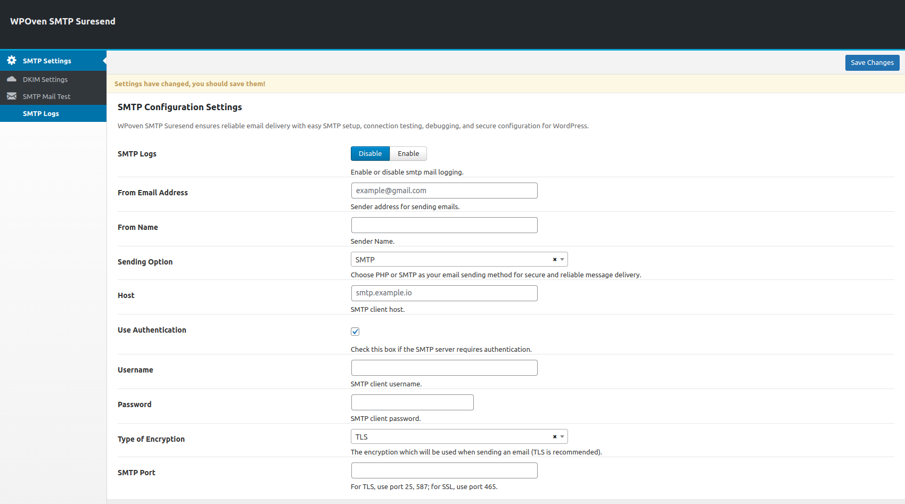
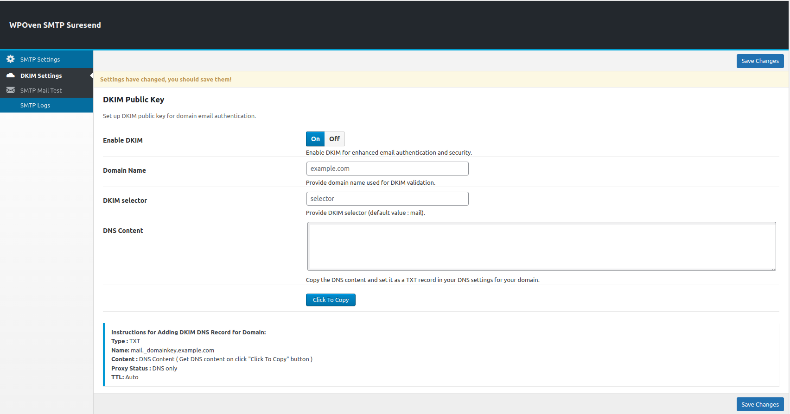
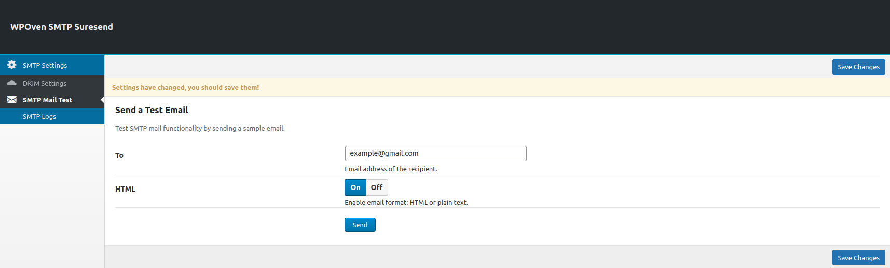

**Contributors:** [WPOven](https://www.wpoven.com/)  
**Requires at least:** 6.6.2  
**Tested up to:** 6.6.2  
**Stable tag:** 1.0.0  
**License:** GPLv2 or later  
**License URI:** [http://www.gnu.org/licenses/gpl-2.0.html](http://www.gnu.org/licenses/gpl-2.0.html)

## Introduction

WPOven SMTP Suresend is a powerful WordPress plugin designed to improve email deliverability by integrating SMTP authentication, logging, and testing features. It ensures that all site emails are sent reliably and securely, reducing the chances of messages landing in spam. 

With built-in DKIM authentication support, users can enhance email security and improve domain reputation. 

The plugin offers an intuitive interface for configuring SMTP settings, testing email delivery, and managing logs, making it an essential tool for WordPress users seeking seamless email performance.

## Installation

### Download the Plugin

- To get the latest version of WPOven SMTP Suresend :
  - Download letest from the GitHub repository: [Download](https://github.com/baseapp/wpoven_suresend/releases).

### Install the Plugin

- Log in to your WordPress admin dashboard.
- Go to Plugins **Plugins > Add New**.
- Click **Upload Plugin** button.
- Select the downloaded ZIP file and click **Install Now**.

### Activate the Plugin

- Once installed, click **Activate Plugin** to start using it.

## Configure SMTP Settings

Once activated, go to **WPOven > SMTP Suresend** in the WordPress admin menu.

<!-- 
- **SMTP Logs**

  - When enabled, outgoing emails are logged for debugging.

- **From Email Address**

  - The email address used for sending emails.
    - Example: `example@gmail.com`

- **From Name**

  - The sender's name displayed in outgoing emails.
    - Example: `John Doe`

- **Sending Option**

  - Select the email sending method:
    - **SMTP** (recommended) - Uses an SMTP server.
    - **PHP** - Uses the default PHP mail function.

- **Host**

  - The SMTP server address.
    - Example: `smtp.example.io`

- **Use Authentication**

  - Check this box if the SMTP server requires authentication.
  - Most SMTP servers require authentication.

- **Username**

  - The SMTP username used for authentication.
  - Usually the sender's email address.

- **Password**

  - The SMTP client password for authentication.

- **Type of Encryption**

  - Select the security protocol for email transmission:
    - **TLS** (recommended)
    - **SSL** (use if required by your SMTP provider)

- **SMTP Port**

  - The port number used for SMTP connection:
    - **25 or 587** for TLS.
    - **465** for SSL. -->

    | **field**               | **Description** |
|---------------------------|-------------------------------------------------------------|
| **SMTP Logs**             | When enabled, outgoing emails are logged for debugging.    |
| **From Email Address**    | The email address used for sending emails. Example: `example@gmail.com` |
| **From Name**             | The sender's name displayed in outgoing emails. Example: `John Doe` |
| **Sending Option**        | Select the email sending method:**SMTP** (recommended) - Uses an SMTP server.**PHP** - Uses the default PHP mail function. |
| **Host**                  | The SMTP server address. Example: `smtp.example.io` |
| **Use Authentication**    | Check this box if the SMTP server requires authentication.Most SMTP servers require authentication. |
| **Username**              | The SMTP username used for authentication.Usually the sender's email address. |
| **Password**              | The SMTP client password for authentication. |
| **Type of Encryption**    | Select the security protocol for email transmission:**TLS** (recommended)**SSL** (use if required by your SMTP provider) |
| **SMTP Port**             | The port number used for SMTP connection:**25 or 587** for TLS.**465** for SSL. |

  After configuring the settings, click `Save Changes` to apply them.

### DKIM Settings

<!-- - **Enable DKIM**

  - Toggle **On/Off** to enable or disable DKIM authentication.
    - **On**: Enables DKIM for better email security and authentication.
    - **Off**: Disables DKIM.

- **Domain Name**

  - Enter the domain name for which you want to configure DKIM.
    - Example: `example.com`

- **DKIM Selector**

  - A **selector** is a unique identifier for the DKIM record.
  - The default value is **"mail"**, but you can set a custom value.
    - Example: `selector`

- **DNS Content**

  - This field generates a DKIM public key for your domain.
  - The generated value should be added to your **DNS TXT record**.

- **Click To Copy**

  - Click this button to copy the **DNS Content** value.
  - This makes it easier to paste into your domain’s DNS settings.

- **Instructions for Adding DKIM DNS Record**
  - Once you generate the **DNS Content**, follow these steps:

    1. **Record Type:** `TXT`
    2. **Name:** `mail._domainkey.example.com`
    3. **Content:** The **DNS Content** generated above.
    4. **Proxy Status:** DNS only
    5. **TTL:** Auto -->

| **field**                 | **Description** |
|-----------------------------|----------------------------------------------------------------------------------------|
| **Enable DKIM**             | Toggle **On/Off** to enable or disable DKIM authentication.**On**: Enables DKIM for better email security.**Off**: Disables DKIM. |
| **Domain Name**             | Enter the domain name for which you want to configure DKIM.Example: `example.com` |
| **DKIM Selector**           | A **selector** is a unique identifier for the DKIM record.Default value: `"mail"` (can be customized).Example: `selector` |
| **DNS Content**             | Generates a **DKIM public key** for your domain.The value should be added to your **DNS TXT record**. |
| **Click To Copy**           | Click this button to copy the **DNS Content** value for easy pasting into your domain’s DNS settings. |
| **Instructions for Adding DKIM DNS Record** | After generating **DNS Content**, follow these steps:1. **Record Type:** `TXT`2. **Name:** `mail._domainkey.example.com`3. **Content:** The **DNS Content** generated above.4. **Proxy Status:** DNS only5. **TTL:** Auto |

  After adding this record, your DKIM authentication will be enabled, improving email deliverability and security.

### SMTP Mail Test

<!-- - **Send a Test Email**

  - The SMTP Mail Test feature allows you to verify your SMTP configuration by sending a test email.

- **To (Recipient Email)**

  - Enter the email address where the test email should be sent.
    - Example: `example@gmail.com`

- **HTML Format**

  - Toggle **On/Off** to enable or disable HTML formatting.
    - **On**: Sends the email in HTML format.
    - **Off**: Sends the email in plain text. -->

| **field**            | **Description** |
|------------------------|-------------------------------------------------------------|
| **Send a Test Email**  | The SMTP Mail Test feature allows you to verify your SMTP configuration by sending a test email. |
| **To (Recipient Email)** | Enter the email address where the test email should be sent.Example: `example@gmail.com` |
| **HTML Format**        | Toggle **On/Off** to enable or disable HTML formatting.**On**: Sends the email in HTML format.**Off**: Sends the email in plain text. |

## Features

- **SMTP Email Testing**

  Test email delivery directly from your WordPress dashboard to verify that emails are being sent successfully.

- **Email Logs**

  Keep a comprehensive log of all emails sent from your website. Easily view, search, and troubleshoot past email activity, ensuring transparency and control over email communications.

- **DKIM (DomainKeys Identified Mail) Settings**

  Configure DKIM authentication to improve email deliverability and prevent messages from ending up in spam folders. With DKIM, emails are signed with a unique signature, verifying your domain and increasing trust with email providers.

## Frequently Asked Questions

- #### What Is WPOven SMTP Suresend?

  The WPOven SMTP Suresend is a tool designed for managing SMTP configurations, enabling secure and reliable email sending through WordPress.

- #### What’s required to use WPOven SMTP Suresend?

  To use WPOven SMTP Suresend, you'll need SMTP server details like address, port, username, password, and encryption method for secure emailing.

- #### Is the WPOven SMTP Suresend plugin free?

  Yes, the WPOven SMTP Suresend plugin is free.

- #### Will WPOven SMTP Suresend slow down my website ?

  Sending an email using SMTP through WPOven SMTP Suresend doesn't add noticeable delays compared to using PHP's mail function.

- #### Who should use WPOven SMTP Suresend Plugin?

  WPOven SMTP Suresend is ideal for anyone using WordPress and needing reliable, secure, and customizable email delivery through SMTP.

- #### Can I resend emails that were previously sent using your plugin?

  WPOven SMTP Suresend is ideal for anyone using WordPress and needing reliable, secure, and customizable email delivery through SMTP.

- #### Can I resend emails that were previously sent using your plugin?

  Yes, you can resend emails that were previously sent using our plugin.

- #### Is it possible to delete sent emails from the log within the plugin?

  Yes, you can delete sent emails from the SMTP logs.

## Changelog

- **1.0.0** ( ***Dec 11, 2024*** )

  - Initial release with enhance email reliability with testing, logging, and DKIM settings for secure, trackable, and consistent delivery.

## Upgrade Notice

- Regularly update the plugin to ensure compatibility with future WordPress versions.
