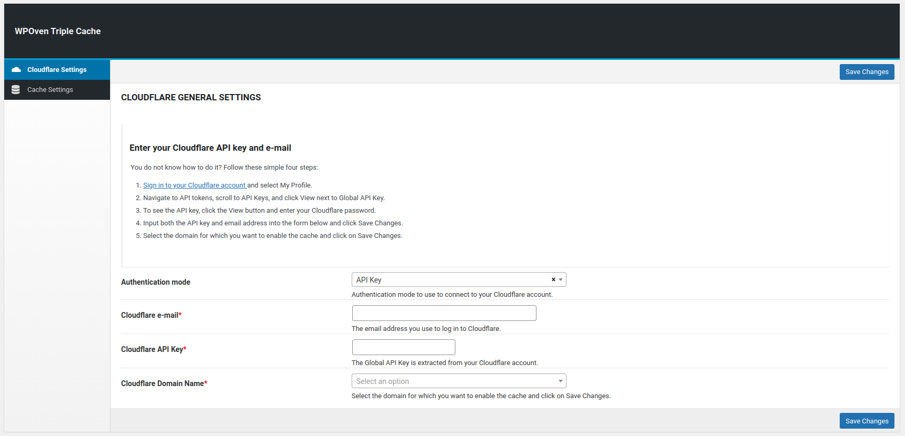
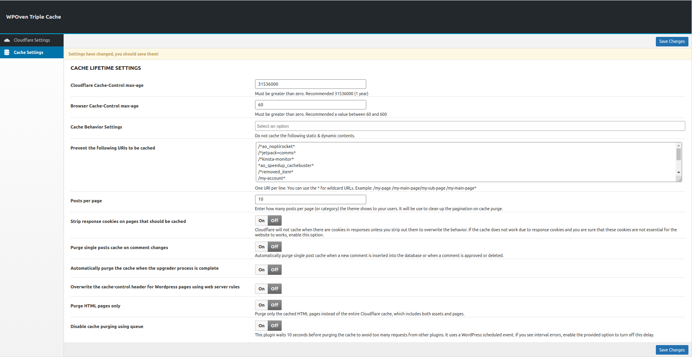

**Contributors:** [WPOven](https://www.wpoven.com/)  
**Requires at least:** 6.6.2  
**Tested up to:** 6.6.2  
**Stable tag:** 1.0.0  
**License:** GPLv2 or later  
**License URI:** [http://www.gnu.org/licenses/gpl-2.0.html](http://www.gnu.org/licenses/gpl-2.0.html)

## Introduction

WPOven Triple Cache is a powerful WordPress plugin that enhances website speed and performance through advanced caching and seamless Cloudflare integration. It optimizes page load times, server performance, and security, ensuring a fast and efficient browsing experience. 

The plugin provides automatic cache purging, customizable caching rules, and easy configuration options, making it a must-have for WordPress users looking to improve their site's performance effortlessly.

## Installation

### Download the Plugin

- To get the latest version of WPOven Triple Cache :
  - Download directly from the GitHub repository: [Download](https://github.com/baseapp/wpoven_triplecache/releases).

### Install the Plugin

- Log in to your WordPress admin dashboard.
- Go to Plugins **Plugins > Add New**.
- Click **Upload Plugin** button.
- Select the downloaded ZIP file and click **Install Now**.

### Activate the Plugin

- Once installed, click **Activate Plugin** to start using it.

### Configure Triple Cache Settings
### Cloudflare Settings
Once activated, go to **WPOven > Triple Cache** in the WordPress admin menu.

    The **Cloudflare Settings** section allows you to integrate Cloudflare caching with **WPOven Triple Cache**. Follow the steps below to set up your Cloudflare API key and enable caching.

- #### How to Get Your Cloudflare API Key?

  1. **[Sign in to your Cloudflare account](https://dash.cloudflare.com/)** and go to **My Profile**.
  2. Navigate to **API Tokens**, scroll to **API Keys**, and click **View** next to **Global API Key**.
  3. Enter your Cloudflare password to view and copy the API key.
  4. Fill in the **Cloudflare e-mail** and **Cloudflare API Key** fields.
  5. Choose your **Cloudflare Domain Name** from the dropdown and click **Save Changes**.

- #### Cloudflare General Settings

  - #### Authentication Mode

    - **Description:** Select the authentication method used to connect to Cloudflare.
    - **Options:** `API Key` (default).

  - #### Cloudflare e-mail

    - **Description:** The email address used to log in to Cloudflare.
    - **Required:** Yes.

  - #### Cloudflare API Key

    - **Description:** The **Global API Key** extracted from your Cloudflare account.
    - **Required:** Yes.

  - #### Cloudflare Domain Name
    - **Description:** Choose the domain for which you want to enable Cloudflare cache.
    - **Required:** Yes.

- #### Saving Changes
  Once all fields are filled, click `Save Changes` to apply the configuration.

### Cache Settings

- #### Cloudflare Cache-Control max-age

  - Defines the maximum cache duration for Cloudflare.
    - Must be greater than zero.
    - Recommended: 31536000 (1 year).

- #### Browser Cache-Control max-age

  - Sets the cache duration for browsers.
    - Must be greater than zero.
    - Recommended: A value between 60 and 600 seconds.

- #### Cache Behavior Settings

  - Allows selecting a specific caching behavior.
    - Choose from available options.

- #### Prevent the following URIs to be cached

  - Lists the URIs that should not be cached. Supports wildcards (\*). - Example: - 
    - `/*ao_noptirocket*`
    - `/*jetpack=comms*`
    - `/*kinsta-monitor*`
    - `*ao_speedup_cachebuster*`
    - `/*removed_item*`
    - `/my-account*`
    - `/wc-api/*`
    - `/edd-api/*`
    - `/wp-json*`
    - `/checkout/*`
    - `/cart/*`

- #### Posts per page

  - Specifies the number of posts per page in themes for pagination cleanup.
    - Example: 10

- #### Strip response cookies on pages that should be cached

  - Cloudflare does not cache when response cookies exist. This option removes unnecessary response cookies to improve caching.

- #### Purge single posts cache on comment changes

  - Automatically clears the cache when a comment is added, approved, or deleted.

- #### Automatically purge the cache when the upgrader process is complete

  - Ensures that the cache is cleared once the WordPress update process completes.

- #### Overwrite the cache-control header for WordPress pages using web server rules

  - Overrides WordPress's default cache-control headers with server-level rules.

- #### Purge HTML pages only

  - Deletes cached HTML pages only, without affecting other cached assets.

- #### Disable cache purging using queue
  - Introduces a 10-second delay before purging cache to avoid overwhelming the server with too many requests.

After configuring the settings, click `Save Changes` to apply them.

## Features

- **Cloudflare Integration**

  Seamlessly integrates with Cloudflare to optimize website performance by reducing load times and enhancing security.

- **Advanced Cache Managemen**

  Provides multiple caching options, including Cloudflare Cache-Control, Browser Cache, and Page Caching, ensuring efficient data retrieval.

- **Automatic Cache Purging**

  Automatically purges cache when updates occur, such as comment changes, plugin updates, and theme modifications, ensuring fresh content delivery.

- **Customizable Caching Rules**

  Allows users to define cache behavior, prevent caching of specific URIs, and strip response cookies for optimal caching performance.

- **Easy Configuration & Management**

  User-friendly settings panel within WordPress admin, making it easy to configure Cloudflare credentials and manage caching settings.

## Frequently Asked Questions

- #### What Is WPOven Triple Cache plugin?

  The WPOven Triple Cache plugin for WordPress integrates Cloudflare to provide advanced caching, resulting in lightning-fast page loads, optimized server performance, and enhanced security.

- #### What happens if I delete the plugin?

  I recommend disabling the plugin before deleting it, which will allow you to restore all information on Cloudflare. After that, you can proceed with the removal. This plugin will erase all stored data from the database, keeping your WordPress installation tidy.

- #### Is the WPOven Triple Cache plugin free?

  Yes, the WPOven Triple Cache plugin is free.

- #### Can I restore all Cloudflare settings as before the plugin activation?

  Yes, there is a `Reset All` button after enable caching.

- #### Do you automatically clean up the cache on website changes?

  Yes, you can enable this option from the cache settings page.

- #### Do you allow to bypass the cache for logged in users even on free plan?

  Yes. This is the main purpose of this plugin.

## Changelog

- **1.0.0** (**_Dec 11, 2024_**)

  - Initial release with integrated Cloudflare for advanced caching and security.

## Upgrade Notice

- Regularly update the plugin to ensure compatibility with future WordPress versions.
