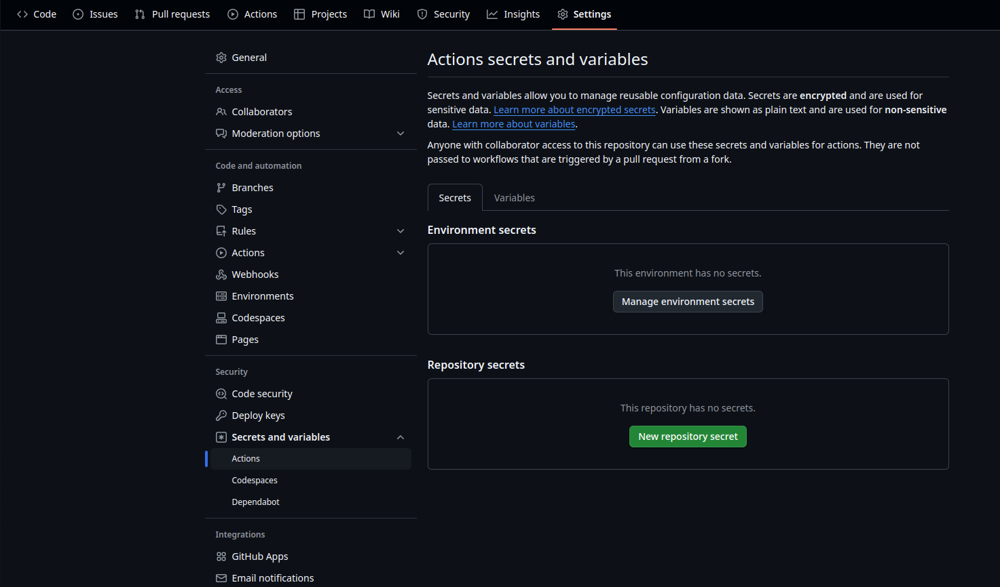
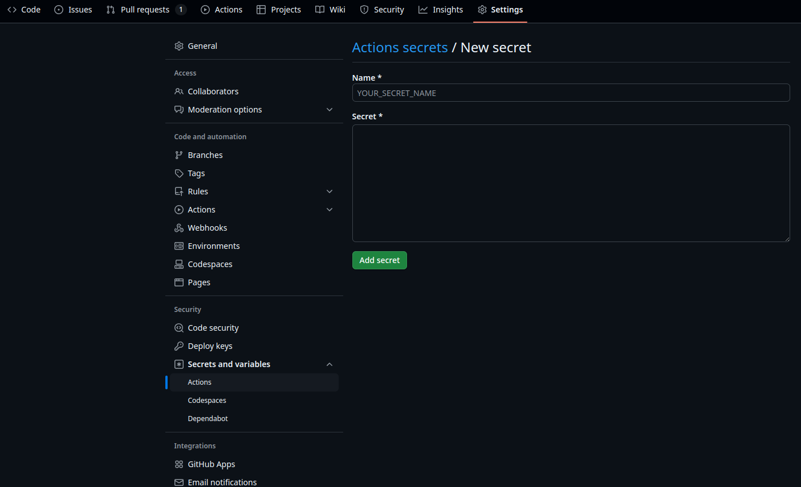
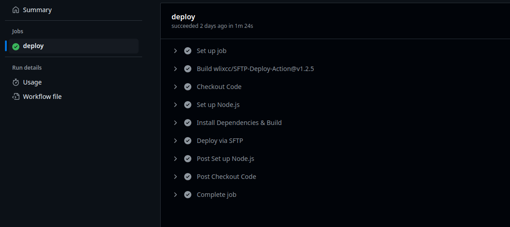

# Deploying Project via SFTP & GitHub Actions

## Overview

Automating the deployment process for your project can save time and reduce errors. In this guide, we will walk through the process of setting up a GitHub Actions workflow to deploy files via SFTP whenever changes are pushed to the `main` branch.

## Prerequisites

Before setting up the workflow, ensure you have:

- A GitHub repository for your project.
- Access to an SFTP server for deployment.
- GitHub Secrets configured for SFTP credentials (`SFTP_HOST`, `SFTP_USER`, and `SFTP_PASS`).

## Setting Up the GitHub Actions Workflow

Create a `.github/workflows/deploy.yml` file in your repository and add the following configuration:

```yaml
name: Automating Project Deployment with GitHub Actions and SFTP.

on:
  push:
    branches:
      - main  # Change as needed

jobs:
  deploy:
    runs-on: ubuntu-latest
    steps:
      - name: Checkout Code
        uses: actions/checkout@v3

      - name: Deploy via SFTP
        uses: wlixcc/SFTP-Deploy-Action@v1.2.5
        with:
          server: ${{ secrets.SFTP_HOST }}
          username: ${{ secrets.SFTP_USER }}
          sftp_only: true
          password: ${{ secrets.SFTP_PASS }}
          local_path: "public/*"  # Adjust this path to match your project's folder structure
          remote_path: "/public_html"  # Adjust this path to match your server's directory
```

## Deploy React App Example
```yaml
name: Deploy WPOven Plugin Docs via SFTP

on:
  push:
    branches:
      - main  # Change as needed

jobs:
  deploy:
    runs-on: ubuntu-latest
    steps:
      - name: Checkout Code
        uses: actions/checkout@v3

      - name: Set up Node.js
        uses: actions/setup-node@v3
        with:
          node-version: '22'  # Specify the Node.js version you need

      - name: Install Dependencies & Build
        run: |
          cd wpoven_docs
          ls
          npm install
          npm run build
      - name: Deploy via SFTP
        uses: wlixcc/SFTP-Deploy-Action@v1.2.5
        with:
          server: ${{ secrets.SFTP_HOST }}
          username: ${{ secrets.SFTP_USER }}
          sftp_only: true
          password: ${{ secrets.SFTP_PASS }}
          local_path: "wpoven_docs/build/*"
          remote_path: "/public_html/docs_html"

```
## Explanation of the Workflow

1. **Trigger:** The workflow runs when changes are pushed to the `main` branch.
2. **Checkout Code:** Fetches the latest code from the repository.
3. **Deploy via SFTP:**
   - Uses the **wlixcc/SFTP-Deploy-Action** to transfer files from the `public/` directory (or any folder you specify) to `/public_html` (or any remote directory) on the server.
   - The **local_path** specifies the folder in your repository to deploy (e.g., `public/` for static websites or `docs/` for documentation).
   - The **remote_path** specifies the target directory on the SFTP server.

## Configuring GitHub Secrets

To keep credentials secure, store them in GitHub Secrets:

### Steps to Add GitHub Secrets

1. Go to your repository on GitHub.
2. Navigate to **Settings > Secrets and Variables > Actions**.

    

3. Click **New repository secret**.
4. Add the following secrets one by one:

    | **Secret Name**  | **Description**                  |
    |------------------|----------------------------------|
    |  SFTP_HOST       | Your SFTP server address.        |
    |  SFTP_USER       | Your SFTP username.              |
    |  SFTP_PASS       | Your SFTP password.              |


   
5. Click `Add secret` after entering each value.

These secrets will be securely stored and accessed within your GitHub Actions workflow.

## Testing and Deployment

After setting up the workflow:

1. Push any changes to the `main` branch.
2. Navigate to **GitHub Actions** in your repository.
3. Monitor the workflow execution under the Deploy Project via SFTP workflow.
4. If successful, your files will be updated on your server.

    

## Example Folder Structure

For this example, let’s assume your project has the following structure:

```
wpoven_docs/
├── .git
├── .github/
│   └── workflows/
|        └── deploy.yml
└── wpoven_docs
    ├── blog/
    ├── build/ 
    |   ├── index.html
    │   ├── styles.css
    │   └── script.js
    ├── docs/
    ├── node_modules/
    ├── src/
    ├── static/
    ├── .gitignore
    ├── babel.config.js
    ├── package-lock.json
    ├── package.json
    ├── sidebars.ts
    ├── tsconfig.ts
    └── README.md

```
1. Local Path: `public/*` (the folder containing your static files or documentation).

2. Remote Path: `/public_html` (the directory on your server where the files will be deployed).

If you’re deploying documentation, you might use:

1. Local Path: `wpoven_docs/build/*`

2. Remote Path: `/public_html/docs_html`

## Pros and Cons of Using GitHub Actions for Deployment

### Pros
- **Automation :**  Reduces manual deployment effort, ensuring consistency.
- **Security :**  Uses GitHub Secrets to protect sensitive credentials.
- **Efficiency :**  Deployments happen automatically on every push to `main`, eliminating delays.
- **Version Control :**  Keeps a history of deployments, making it easier to roll back if needed.
- **Cross-Platform Support :**  Runs on Ubuntu, macOS, and Windows without additional setup.

### Cons
- **Setup Complexity :**  Initial setup requires some configuration and testing.
- **Limited Debugging :**  Debugging issues in GitHub Actions workflows can be challenging without proper logging.
- **Dependency on GitHub :**  If GitHub Actions experiences downtime, deployments may be delayed.
- **SFTP Limitations :**  SFTP may not be the fastest or most efficient method for large-scale deployments.

## Conclusion

This GitHub Actions workflow automates the deployment of your project files via SFTP, reducing manual intervention and ensuring your files are always up-to-date. With this setup, every push to the `main` branch triggers an automatic deployment. While there are some drawbacks, the benefits of automation, security, and efficiency make it a valuable solution for managing project updates. Happy coding!

## Notes

1. Replace `public/*` and `/public_html` with the appropriate paths for your project.

2. If your project requires additional steps (e.g., building or compressing files), you can add those steps to the workflow before the SFTP deployment step.
